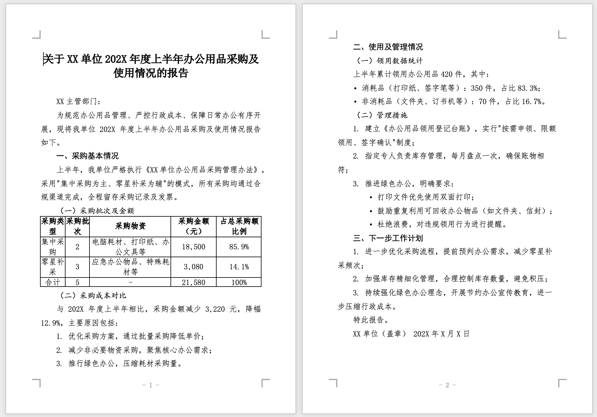

# FormalDoc

[](https://github.com/shrektan/formaldoc/releases)
[](LICENSE)

[中文文档](./README_zh.md)

**FormalDoc** is a browser-based Markdown to Word converter that generates professionally formatted .docx files. Originally designed for Chinese government documents (公文) following GB/T 9704-2012 standards, it now supports multiple document formats for both Chinese and English.

Paste content from AI tools (豆包, 千问, DeepSeek, Kimi, ChatGPT, Claude, etc.) and generate a formal Word document in one click.

## Demo

Try it now: [formaldoc.app](https://formaldoc.app)



## Why FormalDoc?

### Smart Paste
Rich text from AI chatbots is **automatically converted to Markdown**. Headings, lists, tables, code blocks, and formatting are preserved—no manual conversion needed.

### Native Word Equations
LaTeX formulas are converted to **native, editable Word equations** (OMML format). Edit them directly in Microsoft Word's equation editor.

### Proper Word Styles
Generated DOCX files use **proper Word styles (样式)**, not hard-coded formatting. Change a style in Word and all matching content updates automatically.

### Instant & Offline
Generate Word documents **instantly in your browser**. No server processing, no uploads. Works offline after first load. Your documents never leave your device.

### Multiple Templates
Choose from **8 professional templates**—4 Chinese formats (government, academic, business) and 4 English formats (standard, business, academic, legal).

## How It Works

1. Copy text from AI (豆包, 千问, DeepSeek, Kimi, ChatGPT, Claude, etc.)
2. Paste into FormalDoc (rich text auto-converts to Markdown)
3. Select your preferred template
4. Click "Download Word Document"
5. Open in Word and edit as needed

## Features

| Feature | Description |
|---------|-------------|
| **Smart Paste** | Auto-converts HTML to Markdown when pasting from AI chatbots |
| **LaTeX Formulas** | Converts `$...$` and `$$...$$` to native Word equations |
| **Quote Conversion** | One-click convert English quotes to Chinese quotes ("..." → "...") |
| **8 Templates** | Chinese government, academic, business + English standard, business, academic, legal |
| **Customizable Styles** | Adjust fonts, sizes, bold/italic for each element |
| **Auto Filename** | Intelligently extracts document title for the filename |
| **Multi-language UI** | Chinese and English interface |
| **Mobile Friendly** | Responsive design works on phones and tablets |
| **CLI Support** | Command-line tool for batch processing |

## Templates

FormalDoc provides 8 professional document templates:

### Chinese Templates

| Template | Description | Body Font | Line Spacing |
|----------|-------------|-----------|--------------|
| **cn-gov** | Government format (GB/T 9704-2012) | 仿宋 16pt | Fixed 28pt |
| **cn-general** | General business documents | 宋体 12pt | 1.5× |
| **cn-academic** | Thesis/journal format | 宋体 12pt | 1.5× |
| **cn-report** | Business/work reports | 宋体 12pt | 1.5× |

### English Templates

| Template | Description | Body Font | Line Spacing |
|----------|-------------|-----------|--------------|
| **en-standard** | Standard format | Times New Roman 12pt | 1.5× |
| **en-business** | Modern corporate style | Calibri 11pt | 1.15× |
| **en-academic** | APA-inspired format | Times New Roman 12pt | 2.0× (double) |
| **en-legal** | Contracts/legal documents | Times New Roman 12pt | 1.5× |

### Switching Templates

**Web UI**: Click the template strip at the top or the settings gear icon to select a template.

**CLI**: Use the `-t` or `--template` flag:
```bash
formaldoc input.md -o output.docx -t en-standard
```

## Markdown Support

FormalDoc supports GitHub Flavored Markdown (GFM) with LaTeX math extensions:

| Markdown | Description | Word Style |
|----------|-------------|------------|
| `# Title` | Document title | Title (centered) |
| `## Heading` | Level 1 heading | Heading 1 |
| `### Heading` | Level 2 heading | Heading 2 |
| `#### Heading` | Level 3 heading | Heading 3 |
| `##### Heading` | Level 4 heading | Heading 4 |
| Paragraphs | Body text | Body Text |
| `**bold**` | Bold text | Bold |
| `*italic*` | Italic text | Italic |
| `~~strikethrough~~` | Strikethrough | Strikethrough |
| `[text](url)` | Hyperlinks | External Link |
| `- item` / `1. item` | Lists (nested supported) | List Paragraph |
| `> quote` | Blockquotes | Blockquote (gray background) |
| `` `code` `` | Inline code | Monospace |
| ` ``` ` | Code blocks | Code block |
| `\| table \|` | GFM tables | Table styles |
| `$...$` | Inline math | Inline equation |
| `$$...$$` | Block math | Centered equation |

### Style Mapping (cn-gov template)

| Markdown | Word Style | Font |
|----------|------------|------|
| `# Title` | 公文标题 | 宋体 22pt bold, centered |
| `## Heading` | 一级标题 | 黑体 16pt |
| `### Heading` | 二级标题 | 楷体 16pt |
| `#### Heading` | 三级标题 | 仿宋 16pt bold |
| `##### Heading` | 四级标题 | 仿宋 16pt bold |
| Paragraph | 正文 | 仿宋 16pt, 2-char indent |
| List | 列表项 | 仿宋 16pt |
| Table | 表格 | 仿宋 16pt, centered |
| Page Footer | - | 仿宋 14pt, "- 1 -" format |

### Style Mapping (en-standard template)

| Markdown | Word Style | Font |
|----------|------------|------|
| `# Title` | Title | Arial 20pt bold, centered |
| `## Heading` | Heading 1 | Arial 16pt bold |
| `### Heading` | Heading 2 | Arial 14pt bold |
| `#### Heading` | Heading 3 | Arial 12pt bold |
| `##### Heading` | Heading 4 | Arial 12pt bold italic |
| Paragraph | Body Text | Times New Roman 12pt |
| List | List Paragraph | Times New Roman 12pt |
| Table Header | Table Header | Arial 11pt bold |
| Table Cell | Table Text | Times New Roman 11pt |

## Command-Line Interface (CLI)

FormalDoc includes a CLI for batch processing and automation.

### Installation

```bash
# Clone the repository
git clone https://github.com/shrektan/formaldoc.git
cd formaldoc

# Install dependencies
npm install

# Link CLI globally
npm run cli:link
```

### Usage

```bash
# Basic usage (uses cn-gov template by default)
formaldoc document.md

# Specify output file
formaldoc document.md -o output.docx

# Use a different template
formaldoc document.md -t en-standard

# Apply custom styles from JSON file
formaldoc document.md -t cn-gov -s custom-styles.json

# Read from stdin
cat document.md | formaldoc --stdin -o output.docx

# Show help
formaldoc --help

# Show version
formaldoc --version
```

### Custom Styles JSON

Create a JSON file to override default template styles:

```json
{
  "title": {
    "font": "Arial",
    "size": 24,
    "bold": true,
    "center": true
  },
  "bodyText": {
    "font": "Times New Roman",
    "size": 12,
    "indent": false
  },
  "heading1": {
    "font": "Arial",
    "size": 18,
    "bold": true
  }
}
```

**Available style keys**: `title`, `heading1`, `heading2`, `heading3`, `heading4`, `bodyText`, `listItem`, `blockquote`, `tableHeader`, `tableCell`, `pageFooter`

**Style properties**: `font`, `size`, `bold`, `italic`, `center`, `indent`

## LaTeX Formula Support

FormalDoc converts LaTeX math to native Word equations that you can edit in Microsoft Word.

### Syntax

- **Inline formulas**: `$E = mc^2$` renders within text
- **Block formulas**: `$$\int_0^\infty e^{-x^2} dx = \frac{\sqrt{\pi}}{2}$$` renders centered on its own line

### Supported Features

- Fractions: `\frac{a}{b}`
- Superscripts/subscripts: `x^2`, `x_i`
- Greek letters: `\alpha`, `\beta`, `\gamma`
- Roots: `\sqrt{x}`, `\sqrt[3]{x}`
- Sums/integrals: `\sum_{i=1}^n`, `\int_a^b`
- Matrices: `\begin{pmatrix}...\end{pmatrix}`
- And more (powered by KaTeX)

### Conversion Pipeline

```
LaTeX → KaTeX (MathML) → mathml2omml (OMML) → Word Equation
```

If conversion fails, the formula is preserved as plain text.

## Tech Stack

| Library | Purpose |
|---------|---------|
| [React 19](https://react.dev/) | UI framework |
| [TypeScript](https://www.typescriptlang.org/) | Type safety |
| [Vite](https://vite.dev/) | Build tool |
| [docx](https://docx.js.org/) | Word document generation |
| [unified](https://unifiedjs.com/) + [remark](https://github.com/remarkjs/remark) | Markdown parsing |
| [remark-gfm](https://github.com/remarkjs/remark-gfm) | GitHub Flavored Markdown |
| [remark-math](https://github.com/remarkjs/remark-math) | LaTeX math parsing |
| [Turndown](https://github.com/mixmark-io/turndown) | HTML to Markdown conversion |
| [KaTeX](https://katex.org/) | LaTeX rendering |
| [mathml2omml](https://www.npmjs.com/package/mathml2omml) | MathML to Word equations |
| [jsdom](https://github.com/jsdom/jsdom) | DOM polyfill for CLI |

## Development

### Prerequisites

- [Node.js](https://nodejs.org/) 18+ or [Bun](https://bun.sh/) 1.0+
- npm or bun package manager

### Setup

```bash
# Clone the repository
git clone https://github.com/shrektan/formaldoc.git
cd formaldoc

# Install dependencies
npm install

# Start development server
npm run dev

# Open http://localhost:5173 in your browser
```

### Scripts

| Command | Description |
|---------|-------------|
| `npm run dev` | Start development server with HMR |
| `npm run build` | Build for production |
| `npm run preview` | Preview production build |
| `npm run format` | Format code with Prettier |
| `npm run lint` | Check for linting errors |
| `npm run lint:fix` | Auto-fix linting errors |
| `npm run test` | Run all tests (~20s) |
| `npm run test:fast` | Run unit tests only (~1.5s) |
| `npm run test:watch` | Run tests in watch mode |

### Testing

```bash
# Run all tests (includes CLI integration tests)
npm run test

# Run fast unit tests only (recommended during development)
npm run test:fast

# Run tests in watch mode
npm run test:watch
```

**Note**: CLI tests (`cli/cli.test.ts`) are slower (~19s) because they spawn subprocesses. Use `test:fast` for quick feedback during development.

### Code Quality

Before committing, ensure your code passes all checks:

```bash
npm run format      # Format with Prettier
npm run lint:fix    # Fix linting errors
npm run build       # Verify build passes
```

## Project Structure

```
formaldoc/
├── src/
│   ├── App.tsx                 # Main application component
│   ├── main.tsx                # React entry point
│   ├── components/             # React components
│   │   ├── Editor/             # Markdown editor with paste handling
│   │   ├── TemplateStrip/      # Template selection strip
│   │   ├── TemplateGallery/    # Template gallery modal
│   │   ├── StyleSettings/      # Style customization drawer
│   │   ├── Toolbar/            # Action buttons
│   │   └── LoadingOverlay/     # Loading spinner
│   ├── hooks/                  # Custom React hooks
│   │   ├── useDocxGenerator.ts # Document generation hook
│   │   └── useTranslation.ts   # i18n hook
│   ├── contexts/               # React contexts
│   │   ├── StyleContext.tsx    # Style state management
│   │   └── LanguageContext.tsx # Language state management
│   ├── lib/                    # Core libraries
│   │   ├── markdown/           # Markdown parsing
│   │   ├── docx/               # Word document generation
│   │   ├── math/               # LaTeX to Word conversion
│   │   ├── styles/             # Template & style definitions
│   │   └── html-to-markdown.ts # HTML conversion
│   ├── types/                  # TypeScript type definitions
│   ├── i18n/                   # Translations & examples
│   └── styles/                 # CSS styles
├── cli/                        # Command-line interface
│   ├── index.ts                # CLI entry point
│   ├── dom-polyfill.ts         # DOM polyfill for Node.js
│   └── cli.test.ts             # CLI integration tests
├── docs/                       # Documentation assets
├── package.json                # Dependencies & scripts
└── README.md                   # This file
```

## Architecture

### Conversion Pipeline

```
┌─────────────────┐
│  User Input     │  (Paste from AI / Type Markdown)
└────────┬────────┘
         │
         ▼
┌─────────────────┐
│  Smart Paste    │  (HTML → Markdown via Turndown)
└────────┬────────┘
         │
         ▼
┌─────────────────┐
│  Markdown       │  (User edits in textarea)
└────────┬────────┘
         │
         ▼
┌─────────────────┐
│  Parser         │  (remark + remark-gfm + remark-math)
└────────┬────────┘
         │
         ▼
┌─────────────────┐
│  mdast AST      │  (Markdown Abstract Syntax Tree)
└────────┬────────┘
         │
         ▼
┌─────────────────┐
│  Converter      │  (mdast → docx elements)
│                 │  - Headings → Word styles
│                 │  - Paragraphs → Body text
│                 │  - Lists → Nested lists
│                 │  - Tables → Word tables
│                 │  - Math → OMML equations
│                 │  - Links → Hyperlinks
└────────┬────────┘
         │
         ▼
┌─────────────────┐
│  docx Document  │  (Document object with styles)
└────────┬────────┘
         │
         ▼
┌─────────────────┐
│  Packer         │  (Serialize to binary)
└────────┬────────┘
         │
         ▼
┌─────────────────┐
│  .docx File     │  (Download via FileSaver)
└─────────────────┘
```

### Key Design Decisions

1. **Client-side only**: All processing happens in the browser. No server, no uploads, complete privacy.

2. **Word styles over formatting**: Documents use proper Word styles, making them easy to modify in Word.

3. **Native equations**: LaTeX is converted to OMML (Word's equation format), not images or MathML.

4. **Font references**: Fonts are referenced by name, not embedded. This keeps file sizes small but requires the user to have fonts installed.

5. **Template-based**: Predefined templates ensure professional formatting without manual configuration.

## Contributing

Contributions are welcome! Please ensure your code passes linting and tests before submitting a pull request.

```bash
npm run format
npm run lint:fix
npm run test
npm run build
```

## License

[Apache-2.0](LICENSE)

---

**FormalDoc** — Markdown → Word, instantly.
