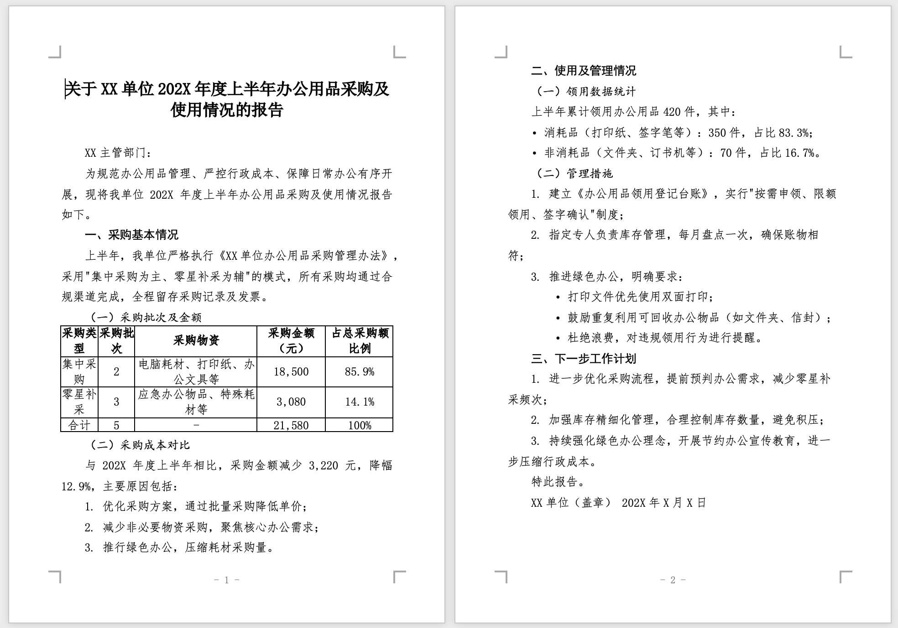

# FormalDoc

[](https://www.npmjs.com/package/formaldoc)
[](LICENSE)

[中文文档](./README_zh.md)

FormalDoc converts Markdown into professionally formatted `.docx` files.

It started as a browser-based generator for Chinese official documents that follow GB/T 9704-2012, and now also ships as a published npm package that can be used in:

- the web app
- Node.js scripts
- the CLI
- Claude, Codex, and other AI tools that can run code or load a skill

If you already have Markdown from ChatGPT, Claude, DeepSeek, Kimi, Qwen, Doubao, or any other AI tool, FormalDoc can turn it into a Word document with the right styles, headings, spacing, tables, and formulas.

## Try It

- Web app: [formaldoc.app](https://formaldoc.app)
- npm package: [`formaldoc` on npm](https://www.npmjs.com/package/formaldoc)
- Included AI skill: [`skills/formaldoc/SKILL.md`](./skills/formaldoc/SKILL.md)



## Why This Exists

Most AI tools are good at generating content, but weak at delivering polished `.docx` output. Users usually end up:

- copying rich text into Word and fixing formatting by hand
- losing structure when converting from HTML or chat output
- rebuilding headings, tables, and equations manually
- struggling to match Chinese government, report, academic, or English business formats

FormalDoc closes that gap. It lets humans and AI generate content in Markdown first, then export a document that is much closer to a final deliverable.

## What You Can Use

FormalDoc is not just a demo site. It is a real package and workflow surface.

### 1. Web app

Paste content into the browser and download a `.docx` file locally.

- Rich text pasted from AI chat apps is converted to Markdown automatically
- No server-side document generation
- Works well for one-off exports and manual editing

### 2. npm package

FormalDoc is published to npm as [`formaldoc`](https://www.npmjs.com/package/formaldoc).

Use it when you want:

- programmatic `.docx` generation in Node.js
- batch export from Markdown files
- CI or local automation
- AI agent workflows that can run `npm install formaldoc`

### 3. CLI

Use the CLI when you already have Markdown files on disk and want direct file-to-file conversion.

### 4. AI skill

This repo includes a reusable skill at [`skills/formaldoc/SKILL.md`](./skills/formaldoc/SKILL.md).

That skill is designed for Claude-style agent workflows and can also be adapted for other AI tools that support:

- reusable prompt/skill files
- code execution
- npm package installation
- file outputs

With the skill, an AI tool can take Markdown content and generate a `.docx` directly instead of only returning Markdown or plain text.

## Core Capabilities

### Smart paste from AI tools

Rich HTML copied from chat products is normalized into Markdown while preserving structure such as:

- headings
- lists
- tables
- code blocks
- inline emphasis

### Native Word equations

LaTeX formulas are converted into editable Word equations instead of screenshots or plain text math.

### Proper Word styles

Generated documents use Word styles rather than only hard-coded formatting, so the result is easier to edit in Microsoft Word.

### Chinese and English templates

FormalDoc ships with 8 built-in templates:

| Template | Use case |
| --- | --- |
| `cn-gov` | Chinese government / official documents |
| `cn-general` | Chinese general-purpose documents |
| `cn-academic` | Chinese academic writing |
| `cn-report` | Chinese reports / work summaries |
| `en-standard` | Standard English documents |
| `en-business` | Modern English business documents |
| `en-academic` | English academic papers |
| `en-legal` | English legal / contract-style docs |

### Local-first browser generation

The web app generates documents in the browser, which is useful when users want privacy and zero-upload workflows.

## Quick Start

### Use the web app

1. Open [formaldoc.app](https://formaldoc.app)
2. Paste Markdown or rich text from an AI tool
3. Choose a template
4. Download the generated `.docx`

### Install from npm

```bash
npm install formaldoc
```

### Run with `npx`

```bash
npx formaldoc input.md -o output.docx
```

### Install globally

```bash
npm install -g formaldoc
formaldoc input.md -o output.docx
```

## Node.js API

FormalDoc is ESM-first.

### Convert Markdown in memory

```ts
import { writeFile } from 'node:fs/promises';
import { convertMarkdownToDocx } from 'formaldoc';

const result = await convertMarkdownToDocx({
  markdown: '# Hello\n\nGenerated by FormalDoc.',
  templateName: 'en-business',
});

await writeFile('output.docx', result.buffer);
console.log(result.outputPath ?? 'output.docx');
```

### Convert from a Markdown file

When you already have a `.md` file, prefer the file-based API:

```ts
import { convertMarkdownToDocxFile } from 'formaldoc';

const result = await convertMarkdownToDocxFile({
  inputPath: './input.md',
  outputPath: './output.docx',
  templateName: 'cn-report',
});

console.log(result.outputPath);
```

## CLI Usage

```bash
# Default template: cn-gov
formaldoc document.md

# Write to a specific file
formaldoc document.md -o output.docx

# Pick a template
formaldoc document.md -t en-standard

# Read from stdin
cat document.md | formaldoc --stdin -o output.docx

# Help
formaldoc --help
```

## Use With Claude Or Other AI Tools

FormalDoc is especially useful in AI-assisted document workflows.

Typical flow:

1. The AI writes or receives Markdown content
2. The AI selects a template
3. The AI installs `formaldoc` from npm
4. The AI runs the Node API or CLI
5. The AI returns the generated `.docx`

This means the AI can produce a real Word document, not just draft text.

### Why the skill matters

The included skill gives an AI tool enough instruction to:

- choose an appropriate template
- prefer file-based conversion when a Markdown file already exists
- fall back to inline conversion when needed
- save the generated `.docx` as a real output artifact

If you use Claude Projects, Claude Code style environments, or other agent systems with reusable instructions, start from:

- [`skills/formaldoc/SKILL.md`](./skills/formaldoc/SKILL.md)
- [`docs/claude-file-creation.md`](./docs/claude-file-creation.md)
- [`docs/claude-project-instructions.md`](./docs/claude-project-instructions.md)

## Included Skill

This repository now includes the FormalDoc skill directly so users and AI agents can discover it from the repo itself instead of relying on an external snippet.

Path:

```text
skills/formaldoc/SKILL.md
```

You can copy that file into your own skill system, Claude Project instructions, agent prompt library, or other AI automation environment.

### Install the skill with `npx`

If you use the `skills` installer ecosystem, you can install the skill directly from this GitHub repository:

```bash
npx skills add https://github.com/shrektan/formaldoc --skill formaldoc
```

Examples:

```bash
# Install globally for Claude Code
npx skills add https://github.com/shrektan/formaldoc --skill formaldoc -g -a claude-code -y

# Install globally for Codex
npx skills add https://github.com/shrektan/formaldoc --skill formaldoc -g -a codex -y
```

Important:

- this flow installs the skill from GitHub, not from the npm tarball
- the repository must be pushed to GitHub before others can install the latest skill version
- the skill name is `formaldoc`, which matches the included frontmatter

## Markdown Support

FormalDoc supports GitHub Flavored Markdown plus LaTeX math.

| Markdown | Output |
| --- | --- |
| `# Title` | Document title |
| `## Heading` | Heading 1 |
| `### Heading` | Heading 2 |
| `#### Heading` | Heading 3 |
| `##### Heading` | Heading 4 |
| Paragraphs | Body text |
| `**bold**` | Bold text |
| `*italic*` | Italic text |
| `~~strike~~` | Strikethrough |
| `[text](url)` | Hyperlinks |
| `- item` / `1. item` | Lists |
| `> quote` | Blockquotes |
| `` `code` `` | Inline code |
| Code fences | Code blocks |
| GFM tables | Word tables |
| `$...$` | Inline equations |
| `$$...$$` | Block equations |

## Template Notes

### Chinese templates

| Template | Description | Typical font |
| --- | --- | --- |
| `cn-gov` | GB/T 9704-style official document | 仿宋 / 宋体 / 黑体 mix |
| `cn-general` | General Chinese document | 宋体 |
| `cn-academic` | Chinese academic format | 宋体 |
| `cn-report` | Chinese report / business summary | 宋体 |

### English templates

| Template | Description | Typical font |
| --- | --- | --- |
| `en-standard` | Standard English format | Times New Roman + Arial |
| `en-business` | Business format | Calibri + Arial |
| `en-academic` | Academic format | Times New Roman |
| `en-legal` | Legal format | Times New Roman |

## Development

```bash
npm run dev
npm run build
npm run lint
```

Project layout:

- `src/`: React app and document generation logic
- `cli/`: CLI entrypoint
- `docs/`: supporting documentation
- `skills/`: AI skill definitions included with the repo

## Repository Positioning

FormalDoc should be understood as all of the following at once:

- a user-facing web app
- a published npm package
- a CLI for Markdown-to-DOCX conversion
- an AI-native document generation building block

If you are evaluating the project, that combined positioning is the important part: a human can use the app directly, and an AI agent can also use the same engine to generate `.docx` deliverables programmatically.

## License

Apache-2.0. See [LICENSE](LICENSE).
