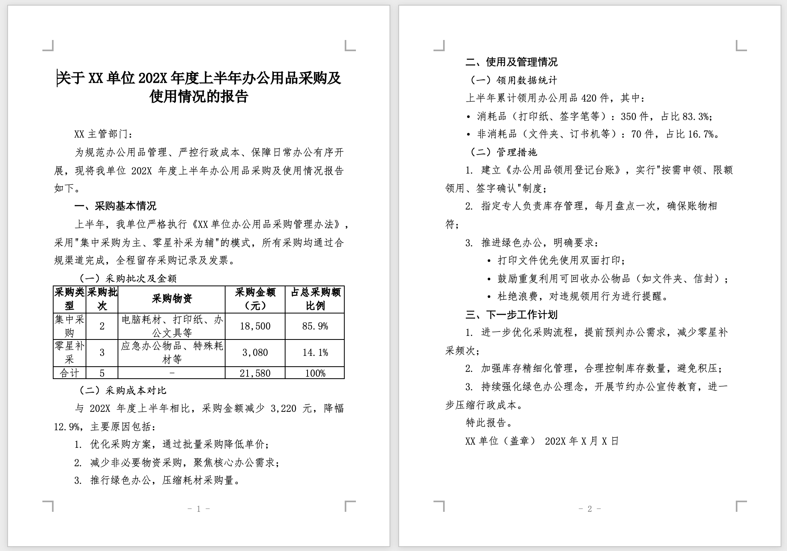

# FormalDoc

[](https://www.npmjs.com/package/formaldoc)
[](LICENSE)

[English](./README.md)

FormalDoc 把 Markdown 转成排版正式、可以继续编辑的 Word 文档。

它面向的是已经用 AI 或 Markdown 写内容、但最终仍然需要 `.docx` 交付物的人：标题、层级、间距、表格、模板和公式都应该尽量一次到位，而不是导出后再手工修半天。

- Web 应用：[formaldoc.app](https://formaldoc.app)
- npm 包：[npm 上的 `formaldoc`](https://www.npmjs.com/package/formaldoc)
- AI skill：[`skills/formaldoc/SKILL.md`](./skills/formaldoc/SKILL.md)



## 为什么需要 FormalDoc

AI 工具很会写内容，但直接交付 Word 文档仍然很痛。你从 ChatGPT、Claude、DeepSeek、Kimi、Qwen、豆包或其他工具复制内容时，经常会遇到：

- 标题层级要重新整理
- 字体、字号、行距不统一
- 表格从富文本复制后很难看
- LaTeX 公式变成普通文本或截图
- 中文公文、报告、论文格式很难手工快速套好

FormalDoc 解决的是最后一公里：先用 Markdown 写清楚内容，再生成更接近正式交付状态的 `.docx`。

## 核心卖点

### 面向 AI 内容的智能粘贴

直接粘贴 Markdown，或者从 AI 聊天窗口复制富文本。FormalDoc 会把内容标准化成 Markdown，并尽量保留关键结构：

- 标题
- 列表
- 表格
- 代码块
- 粗体、斜体、链接和行内结构

它不是只服务“手写 Markdown”的极客工具，而是为真实的 AI 写作和编辑流程准备的。

### LaTeX 公式转成可编辑 Word 公式

FormalDoc 对 LaTeX 数学公式是专门支持的。公式会被转换成 Word 原生公式，在 Microsoft Word 里可以继续编辑，而不是变成图片或一段普通文本。

### 正式模板，而不是普通导出

内置中文和英文模板，覆盖公文、报告、论文、商务文档和法律/合同风格文档。

### 浏览器本地生成

Web 应用在浏览器内生成文档。一次性导出时，打开网页、粘贴内容、选择模板、下载 `.docx` 即可，不需要搭建后端流程。

### 也适合自动化

FormalDoc 同时是 npm 包、CLI 和 AI agent 可调用的文档生成模块。浏览器、Node.js 脚本、终端命令和 AI skill 使用的是同一套文档生成能力。

## LaTeX 公式支持

公式支持是 FormalDoc 目前最值得单独强调的能力之一。

| 输入 | Word 输出 |
| --- | --- |
| `$E = mc^2$` | 行内可编辑 Word 公式 |
| `$$\frac{a}{b}$$` | 居中的独立公式 |
| `$\sum_{i=1}^{n} x_i$` | 带上下标/上下限的行内公式 |
| `$$\begin{cases} a & x > 0 \\ b & x \le 0 \end{cases}$$` | 结构化独立公式 |

支持的公式场景包括：

- 正文段落里的行内公式
- 段落之间的独立公式
- 分式、根号、求和、积分、连乘、希腊字母、重音、矩阵和分段函数
- 公式与加粗、强调文本混排
- 从 AI 工具复制出来、可能带转义反斜杠的 LaTeX

底层转换路径是 LaTeX 到 MathML，再到 OMML，最后生成 Word 公式对象。实际效果就是：导出的 `.docx` 使用 Word 原生数学公式模型，而不是截图式的替代方案。

## 模板

FormalDoc 内置 8 个模板。

| 模板 | 适用场景 |
| --- | --- |
| `cn-gov` | 中文政府、公文、正式文件，GB/T 9704 风格 |
| `cn-general` | 中文通用文档 |
| `cn-academic` | 中文学术论文 |
| `cn-report` | 中文报告、工作总结、汇报 |
| `en-standard` | 英文标准文档 |
| `en-business` | 英文商务文档 |
| `en-academic` | 英文学术论文 |
| `en-legal` | 英文法律或合同文档 |

## 快速开始

### 用 Web 应用

1. 打开 [formaldoc.app](https://formaldoc.app)
2. 粘贴 Markdown，或从 AI 工具复制富文本后直接粘贴
3. 选择模板
4. 下载生成的 `.docx`

### 用 `npx` 直接运行

```bash
npx formaldoc input.md -o output.docx
```

### 从 npm 安装

```bash
npm install formaldoc
```

### 全局安装

```bash
npm install -g formaldoc
formaldoc input.md -o output.docx
```

## Markdown 支持

FormalDoc 支持 GitHub Flavored Markdown 和 LaTeX 数学公式。

| Markdown | 输出 |
| --- | --- |
| `# Title` | 文档标题 |
| `## Heading` | 一级标题 |
| `### Heading` | 二级标题 |
| `#### Heading` | 三级标题 |
| `##### Heading` | 四级标题 |
| Paragraphs | 正文段落 |
| `**bold**` | 粗体 |
| `*italic*` | 斜体 |
| `~~strike~~` | 删除线 |
| `[text](url)` | 超链接 |
| `- item` / `1. item` | 列表 |
| `> quote` | 引用块 |
| `` `code` `` | 行内代码 |
| Code fences | 代码块 |
| GFM tables | Word 表格 |
| `$...$` | 行内公式 |
| `$$...$$` | 独立公式 |

## CLI 用法

```bash
# 默认模板：cn-gov
formaldoc document.md

# 指定输出文件
formaldoc document.md -o output.docx

# 选择模板
formaldoc document.md -t en-standard

# 从 stdin 读取
cat document.md | formaldoc --stdin -o output.docx

# 查看帮助
formaldoc --help
```

## Node.js API

FormalDoc 采用 ESM 优先的方式。

### 内存中的 Markdown 转换

```ts
import { writeFile } from 'node:fs/promises';
import { convertMarkdownToDocx } from 'formaldoc';

const result = await convertMarkdownToDocx({
  markdown: '# Hello\n\nGenerated by FormalDoc.',
  templateName: 'en-business',
});

await writeFile('output.docx', result.buffer);
console.log(result.outputPath ?? 'output.docx');
```

### 从 Markdown 文件转换

如果你已经有 `.md` 文件，优先使用文件型 API：

```ts
import { convertMarkdownToDocxFile } from 'formaldoc';

const result = await convertMarkdownToDocxFile({
  inputPath: './input.md',
  outputPath: './output.docx',
  templateName: 'cn-report',
});

console.log(result.outputPath);
```

## 在 Claude、Codex 或其他 AI 工具中使用

FormalDoc 很适合 AI 辅助文档工作流。

典型流程如下：

1. AI 先写出或接收 Markdown 内容
2. AI 选择合适模板
3. AI 从 npm 安装 `formaldoc`
4. AI 调用 Node API 或 CLI
5. AI 返回生成好的 `.docx`

这意味着 AI 不只是产出草稿文本，而是可以直接产出 Word 文档交付物。

### 仓库内置 skill

这个仓库已经包含可复用 skill：[`skills/formaldoc/SKILL.md`](./skills/formaldoc/SKILL.md)

它会指导 AI 工具：

- 选择合适模板
- 当已有 Markdown 文件时优先使用文件型转换
- 必要时再退回内存型转换
- 把生成的 `.docx` 当作真正的输出文件返回

如果你在用 Claude Projects、Claude Code 风格环境、Codex，或者其他支持可复用指令的 agent 系统，建议从这些文件开始：

- [`skills/formaldoc/SKILL.md`](./skills/formaldoc/SKILL.md)
- [`docs/claude-file-creation.md`](./docs/claude-file-creation.md)
- [`docs/claude-project-instructions.md`](./docs/claude-project-instructions.md)

### 用 `npx` 直接安装 skill

如果你使用的是 `skills` 安装器生态，也可以直接从这个 GitHub 仓库安装：

```bash
npx skills add https://github.com/shrektan/formaldoc --skill formaldoc
```

示例：

```bash
# 为 Claude Code 做全局安装
npx skills add https://github.com/shrektan/formaldoc --skill formaldoc -g -a claude-code -y

# 为 Codex 做全局安装
npx skills add https://github.com/shrektan/formaldoc --skill formaldoc -g -a codex -y
```

注意：

- 这条安装路径走的是 GitHub skill 安装流程，不是 npm tarball 分发
- 如果你希望别人拿到最新 skill，必须先把仓库改动 push 到 GitHub
- skill 名称是 `formaldoc`，与仓库内 frontmatter 保持一致

## 开发

```bash
npm run dev
npm run build
npm run lint
```

项目结构：

- `src/`：React 应用和文档生成逻辑
- `cli/`：CLI 入口
- `docs/`：补充文档
- `skills/`：仓库内置 AI skill

## License

Apache-2.0。参见 [LICENSE](LICENSE)。
